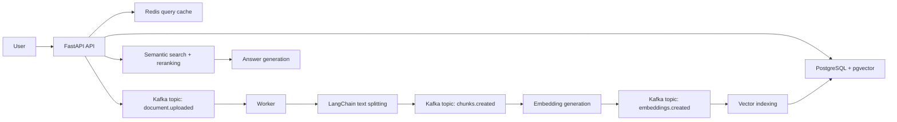

# DocuMind

DocuMind is a distributed RAG platform built with FastAPI, LangChain, Kafka, PostgreSQL with pgvector, Redis, and Docker. It lets users upload documents, processes them asynchronously, indexes chunk embeddings, and answers natural-language questions with semantic retrieval and reranking.

The default implementation uses LangChain `HuggingFaceEmbeddings` with `BAAI/bge-small-en-v1.5`, a CPU-friendly 384-dimensional embedding model, plus a LangChain runnable answer chain. You can later replace `app/services/llm.py` with OpenAI, Gemini, Cohere, Hugging Face, or an internal model through LangChain integrations.

## Architecture



## Run It

1. Copy the environment file:

```powershell
Copy-Item .env.example .env
```

2. Start the stack:

```powershell
docker compose up --build
```

3. Open the API docs:

[http://localhost:8000/docs](http://localhost:8000/docs)

4. Upload a document:

```powershell
curl.exe -F "file=@README.md" http://localhost:8000/documents
```

5. Ask a question:

```powershell
curl.exe -X POST http://localhost:8000/query `
  -H "Content-Type: application/json" `
  -d "{\"question\":\"What is DocuMind?\"}"
```

## Sequential Build Order

Use this order when you recreate the project in another folder by hand.

1. `requirements.txt`
   Add the Python dependencies for FastAPI, Kafka, PostgreSQL, Redis, document parsing, and tests.

2. `.env.example`
   Define service URLs and the RAG tuning knobs.

3. `app/config.py`
   Centralize all environment-driven settings.

4. `app/sql/schema.sql`
   Create the `documents`, `chunks`, `retrieval_events`, and `pipeline_events` tables, plus the pgvector index.

5. `app/db.py`
   Build the async PostgreSQL connection pool and schema initialization.

6. `app/services/chunking.py`
   Implement LangChain `RecursiveCharacterTextSplitter` based overlapping text chunking.

7. `app/services/embeddings.py`
   Configure LangChain `HuggingFaceEmbeddings` with `BAAI/bge-small-en-v1.5` and pgvector serialization.

8. `app/services/text_extraction.py`
   Extract text from `.txt`, `.md`, `.pdf`, and `.docx` files.

9. `app/services/reranker.py`
   Add the cross-encoder-style reranking layer.

10. `app/services/retrieval.py`
    Query pgvector for semantic matches, then rerank the candidates.

11. `app/services/llm.py`
    Generate answers from the retrieved context through a LangChain runnable chain.

12. `app/services/evaluation.py`
    Track latency, retrieval score, and answer quality signals.

13. `app/kafka_bus.py`
    Create reusable Kafka producer/consumer helpers.

14. `app/schemas.py`
    Define request and response models for the API.

15. `app/main.py`
    Build upload, query, health, and document status endpoints.

16. `app/workers/pipeline.py`
    Consume Kafka events and run ingestion, chunking, embedding, and indexing stages.

17. `Dockerfile`
    Package the API and worker image.

18. `docker-compose.yml`
    Run FastAPI, worker, Redpanda/Kafka, PostgreSQL/pgvector, and Redis together.

19. `tests/`
    Add focused tests for chunking, embeddings, reranking, and answer generation.

## API Surface

- `GET /health` checks database, Redis, and Kafka-facing configuration.
- `POST /documents` uploads a document and queues asynchronous processing.
- `GET /documents/{document_id}` returns ingestion/indexing status.
- `POST /query` retrieves relevant chunks, reranks them, generates an answer, caches the result, and records evaluation metrics.
- `GET /metrics/retrieval` returns recent retrieval quality and latency measurements.

## How This Matches The Resume Lines

- Distributed RAG platform: FastAPI API + LangChain RAG services + worker service + Kafka topics + Docker Compose.
- Asynchronous pipelines: upload events flow through `document.uploaded`, `chunks.created`, `embeddings.created`, and `vector.indexed`.
- PostgreSQL semantic search: LangChain-generated embeddings are stored as `vector(384)` values and queried by cosine distance through pgvector.
- Cross-encoder reranking: local reranker scores each query/context pair after vector recall.
- Evaluation and monitoring: `retrieval_events` records latency, top score, answer length, and cache usage.

## Useful Commands

```powershell
docker compose logs -f api
docker compose logs -f worker
docker compose down -v
pytest
```
